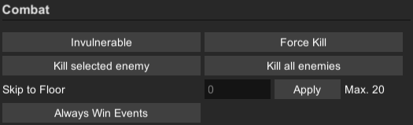
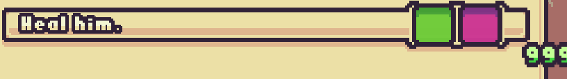

# Die In The Dungeon - Sandbox
This is a Sandbox / Cheat mod for the Steam Game [Die In The Dungeon: Origins](https://store.steampowered.com/app/2428770/Die_in_the_Dungeon_Origins/). It allows you to edit your deck, relics, enemies, skipping floors and more. Perfect for trying different builds, or just skip to the higher floors.

  

# Installation

The game uses [BepInEx](https://github.com/BepInEx/BepInEx), a plugin framework for Unity games. You can download their latest release [here](https://github.com/BepInEx/BepInEx/releases).

Unpack BepInEx in your game folder (Usually something like `C:\Program Files (x86)\Steam\steamapps\common\Die in the Dungeon ORIGINS`), and run the game. This should create a plugin folder under `BepInEx\plugins`.

Download this mod from the [Releases Page](https://github.com/Leyren/DieInTheDungeonOriginsSandbox/releases) and put the DLLs in the plugins folder. Running the game again should now load the plugin and create a configuration file at `BepInEx\config\DieInTheDungeonsSandbox.cfg`.

**Note**: This mod requires [UniverseLib](https://github.com/sinai-dev/UniverseLib), which for convenience is included in the release as well, but you can also download it separately.

  

# Configuration

|Name | Description |
|:---:|:---:|
|Unlimited-Deck|Removes the size limit (24) of your deck, allowing you to have more dices than that. The UI cannot display them though.|
|Hotkey|Hotkey with which to open the Sandbox|
|Show-Button|If `true`, displays an 'Open Sandbox' button in the game, as alternative to the hotkey|

# Ingame UI

To open the ingame UI, press the assigned hotkey or click the 'Open Sandbox' icon in the game:

  

# Features

Here you find a list of features this mod provides, although most of them should be rather self-explanatory.

## Modify Stats
The `Stats` section allows you to modify different values of the game. Enter the amount you want to change the value by (can be negative) and press `Apply`. On the right side it shows you what the current value is.

#### Max Dices In Hand

Increase/Decrease the limit of how many dices you can hold in your hand.

  

#### Energy
Increase/Decrease your amount of energy for this round.

  
  

#### Player Stats

Increase/Decrease your player stats (note that block and health are limited by your max. health)

  
  

#### Enemy Stats

Increase/Decrease the stats of the selected enemy (note that block and health are limited by your max. health)

  
  

## Combat

The `Combat` section has combat & floor related features, to change your progression through the floors.

#### Invulnerable & Force Kill (Toggle)

`Invulnerable` turns you invulnerable, all received damage is set to 0.

`Force Kill` makes every of your attacks deal 9999 damage, instantly killing every enemy.

#### Kill selected enemy / all enemies

As the name suggests, click to kill either the selected enemy, or all of them.

#### Skip to Floor

Let's you skip to specific floor (also back to previous one). Enter the target floor and press `Apply`. Shows the current maximum floor on the right side.

**Note**: After floor 20 (Endless mode), the max floor increases in steps of 5, so you can only skip 5 at a time.

#### Always Win Events

Instantly win events, even without placing any dice. Just click on the event choice and it rolls a 999.

## Relics

#### Open Relic Selection
Click to open the relic reward menu, but with **all** available relics. Use Arrow-Buttons on your keyboard to scroll, and click which one you want to obtain.

#### Get All Relics

Obtain all relics with one click.

## Dices

#### Open Upgrade Menu

Opens your backpack and lets you upgrade any dice, as often as you want.

#### Upgrade All Dices

Upgrade all dices to maximum level immediately.

#### Open Discard Menu

Open the backpack and discard any dice by clicking on it.

#### Pick Dice from Backpack

Open the backpack and click a dice to put it in your hand (also bypasses hand size limit)

#### Get Random Dice

Click to obtain a random dice (into your backpack). This can be **any** of the dices existing in the game.

#### Add Dice
Add a specific dice to your backpack. Select which dice you want and press the button

 

#### Add Property
Add any property to your dice. Select which property you want and press the button. Opens the backpack and lets you click on the dice to which to add the property.

 

